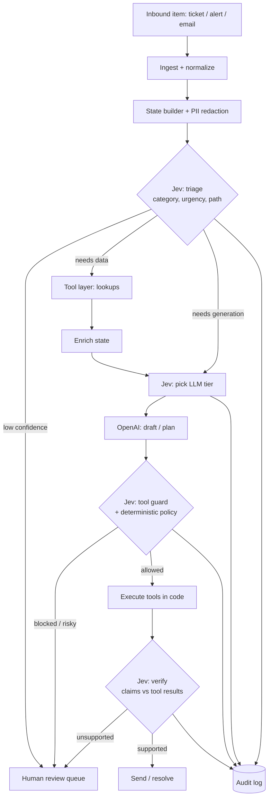

# Sentinel — System One + System Two Ops Agent (Python)

> Build plan for Claude Code. Conventions live in `CLAUDE.md`. Work phase by phase;
> do not skip acceptance criteria.

## 1. What we're building

An FDE-style operations agent that takes inbound work items (support tickets,
alerts, emails), decides what to do with them fast and cheaply, does the work with
an LLM plus tools, **verifies its own claims before acting**, and escalates to a
human whenever confidence is low.

- **System One (Jev)** — fast typed decisions: route, score, yes/no, guard, verify.
  Never writes text, never executes anything.
- **System Two (OpenAI)** — generation and reasoning: drafts replies, plans, summaries.
- **Code** — assembles state, executes tools, enforces permissions. Code is always
  the final authority; model outputs are signals.

Guiding rule: *Jev decides which path, the LLM does the work, code pulls the trigger.*

## 2. Secrets & provider notes (read first)

- All keys live in `.env` (gitignored). Load with `pydantic-settings`. Never log them,
  never put them in prompts, tests, fixtures, or commit history.
- `.env.example` is committed with empty values only.
- Jev provider (default, `JEV_PROVIDER=vercel`): **official TypeSafe Jev
  (`typesafe-ai/jev`) through Vercel AI Gateway**. The gateway reports which upstream
  answered (`finalProvider`) and a `generationId`; both are audited. Fallback:
  `llm_fallback` (OpenAI emulation). Therefore:
  - Everything goes through a `JevProvider` interface so providers swap with a
    config change.
  - Redact PII from state before sending (emails, phone numbers, card numbers).
  - Our eval suite (Phase 5) is the source of truth on quality, not vendor claims.

```
# .env.example
JEV_PROVIDER=vercel           # vercel | typesafe (direct API, later) | llm_fallback
AI_GATEWAY_API_KEY=           # Vercel AI Gateway key (placeholder if proxy-injected)
JEV_GATEWAY_MODEL=typesafe-ai/jev
OPENAI_API_KEY=
OPENAI_MODEL_FAST=            # cheap tier, set to a current model name
OPENAI_MODEL_STRONG=          # capable tier
DATABASE_URL=sqlite:///./sentinel.db
LOG_LEVEL=INFO
```

## 3. Stack

| Concern | Choice |
|---|---|
| Python | 3.12, managed with `uv` |
| HTTP | `httpx` (async) + `tenacity` for retries |
| Models / validation | `pydantic` v2, `pydantic-settings` |
| LLM | `openai` official SDK (structured outputs where needed) |
| API service | `FastAPI` + `uvicorn` |
| Storage | SQLAlchemy 2 + SQLite (dev) / Postgres (prod) |
| Config for policies | YAML (`policies/*.yaml`) |
| Logging | `structlog` JSON logs |
| Tests | `pytest`, `pytest-asyncio`, `respx` (mock HTTP) |
| Lint/type | `ruff`, `mypy --strict` |
| CLI | `typer` |

## 4. Architecture



Pipeline stages (each a pure-ish function with typed input/output):

1. **ingest** → `WorkItem`
2. **build_state** → `State` (redacted, minimal, only what decisions need)
3. **triage** (Jev, one request, parallel questions) → `TriageResult`
4. **enrich** (tools, read-only) → updated `State`
5. **route_model** (Jev choice over allowlisted tiers) → `ModelTier`
6. **generate** (OpenAI) → `Draft` (+ proposed tool calls)
7. **guard** (deterministic policy first, then Jev noul) → allow / escalate
8. **execute** (code only) → `ToolResult[]`
9. **verify** (Jev: does the draft's claim match tool results?) → allow / escalate
10. **decide + emit** → respond, resolve, or enqueue for human

## 5. Repo layout

```
sentinel/
├── pyproject.toml
├── .env.example
├── CLAUDE.md
├── PLAN.md
├── policies/
│   ├── thresholds.yaml        # confidence cutoffs per decision
│   ├── tools.yaml             # tool risk levels + approval rules
│   └── model_tiers.yaml       # allowlisted LLM tiers + descriptions
├── src/sentinel/
│   ├── config.py              # Settings (pydantic-settings)
│   ├── jev/
│   │   ├── provider.py        # JevProvider protocol
│   │   ├── http.py            # shared HTTP provider base (retries, errors)
│   │   ├── vercel.py          # official Jev via Vercel AI Gateway (default)
│   │   ├── typesafe.py        # stub for a direct TypeSafe API (later)
│   │   ├── resilience.py      # rate limit + circuit breaker wrappers
│   │   ├── confidence.py      # Jev's confidence formulas
│   │   ├── llm_fallback.py    # emulates Jev via OpenAI structured output
│   │   ├── questions.py       # Choice / Score / Noul builders
│   │   └── models.py          # request/response pydantic models
│   ├── llm/
│   │   └── openai_client.py   # generate(), tiered models, token accounting
│   ├── agent/
│   │   ├── state.py           # State builder + redaction
│   │   ├── triage.py
│   │   ├── routing.py
│   │   ├── guard.py
│   │   ├── verify.py
│   │   └── pipeline.py        # orchestrates stages, returns Outcome
│   ├── tools/
│   │   ├── registry.py        # tool registration, risk levels
│   │   └── builtin/           # sample tools: lookup_customer, issue_refund (mock)
│   ├── policy/
│   │   └── engine.py          # loads YAML, applies thresholds
│   ├── storage/
│   │   ├── db.py
│   │   └── audit.py           # every decision persisted
│   ├── api/
│   │   └── app.py             # FastAPI: POST /items, GET /items/{id}, /review
│   └── cli.py                 # sentinel run-file, sentinel eval, sentinel probe
├── evals/
│   ├── datasets/*.jsonl       # labeled examples
│   ├── run_eval.py
│   └── metrics.py             # accuracy, Brier, calibration bins, latency, cost
└── tests/
    ├── unit/
    ├── integration/           # respx-mocked Jev + OpenAI
    └── fixtures/
```

## 6. Jev client contract

**Vercel AI Gateway (default, confirmed live 2026-09-25; `jev/vercel.py`):**
`POST {AI_GATEWAY_BASE_URL}/evaluation-model`, headers `ai-model-id: typesafe-ai/jev`,
`ai-evaluation-model-specification-version: 4`, `ai-gateway-protocol-version: 0.0.1`,
`Authorization: Bearer <key>`; body `{ "state", "questions" }` (model in the header).
Yes/no questions are type `boolean` (answer `probability`) on the wire; we map them to
`noul`. Response: `{answers, rounding?, usage?, warnings, providerMetadata: {typesafe:
{confidence}, gateway: {routing: {finalProvider}, cost, generationId}}}`. No versioned
model ID is returned; the requested ID is audited with `model_verified=false`.

Our models (`jev/models.py`) are provider-independent. `state` is string | object |
array of text; questions are keyed by our own IDs; three types:

- `choice` — `criteria` is a map of option → description (≤255 options).
  Answer: `choice`, `probabilities`, `confidence`.
- `score` — `criteria` is an ordered low→high array (2–10 levels).
  Answer: `score` (expected level index), `legend`, `probabilities`, `confidence`.
- `noul` — yes/no, optional `criteria: {true, false}`.
  Answer: `noul` = probability of yes (`boolean`/`probability` on the Vercel wire).

Implementation requirements:

- `JevProvider.evaluate(state, questions, model) -> JevResult` (async).
- Parsers are strict and locked to the live-probed shape; anything unexpected raises,
  never defaults.
- **Confidence semantics (fitted to live samples; `jev/confidence.py`)**: choice =
  `(n·p_max − 1)/(n − 1)`; score = `1 − E|level − modal level| / D_n`, where `D_n`
  is the mean distance from the middle level under a uniform distribution. Score
  value = expected level index. `llm_fallback` derives confidence the same way so
  thresholds mean the same thing across providers.
- Always record the model ID in the audit log (plus the gateway's `generationId` and
  `finalProvider`).
- Retries: exponential backoff with jitter on 429, 503 and 529 (max 4 attempts);
  the gateway returns 503 "try again shortly" when throttling. No retry on
  400/401/403/422; validation errors surface the offending field in the exception.
- Timeouts: 5s connect / 10s read. On final failure → fallback provider or
  human queue (configurable), never silent default answers.
- One judgment per question. Never pack multiple decisions into one question.

## 7. Question catalog (initial)

```python
TRIAGE = {
    "category": choice(
        "Which team should handle this?",
        {
            "billing": "Payments, invoices, refunds, charges",
            "technical": "Bugs, outages, errors, integrations",
            "account": "Login, access, profile, security",
            "sales": "Pricing, upgrades, new accounts",
        },
    ),
    "urgency": score(
        "How urgent is this for the customer's business?",
        ["Not urgent", "Soon", "Today", "Immediately / outage"],
    ),
    "path": choice(
        "What does resolving this need next?",
        {
            "lookup": "Needs account/order data before answering",
            "generate": "Can be answered from the message and policies",
            "human": "Legal, threats, sensitive, or ambiguous",
        },
    ),
    "is_abusive": noul("Is the message abusive or threatening?"),
}

ROUTE_MODEL = choice(
    "Which approved model tier fits this task?",
    {
        "fast": "Short, routine, low-risk replies",
        "strong": "Multi-step reasoning, long context, disputes, money",
    },
)

GUARD = noul(
    "Is it safe to run this tool call without human approval?",
    criteria={
        "true": "Read-only or reversible, in scope, within policy",
        "false": "Destructive, irreversible, out of scope, or unclear",
    },
)

VERIFY = {
    "claim_supported": noul("Is every factual claim in `draft` supported by `tool_results`?"),
    "task_status": choice(
        "Based on tool results, what is the task status?",
        {
            "complete": "All required actions succeeded",
            "verify_more": "Partial evidence, needs another check",
            "failed": "A required action failed or was not run",
        },
    ),
}

# When no tools ran, verify uses this instead (VERIFY's "supported by
# tool_results" is ill-posed with empty results and flags harmless replies).
VERIFY_REPLY = {
    "claim_supported": noul(
        "Is every factual claim in `draft` supported by `account` or `customer_message`? "
        "Questions and offers of help are not factual claims."
    ),
}
```

## 8. Decision policy (policies/thresholds.yaml)

| Decision | Auto-proceed when | Otherwise |
|---|---|---|
| triage.category | confidence ≥ 0.75 | human queue |
| triage.path | confidence ≥ 0.6 | human queue |
| triage.path == human | always | human queue |
| is_abusive | noul ≥ 0.6 → escalate | continue |
| route_model | confidence ≥ 0.6 | default to `strong` |
| guard | deterministic policy allows **and** noul ≥ 0.9 | human approval |
| verify.claim_supported | noul ≥ 0.85 **and** task_status == complete | human queue |

Deterministic rules in `tools.yaml` always win (e.g. `issue_refund` > £100 requires
approval regardless of Jev). Thresholds get tuned from eval data, not by feel.

## 9. Build phases (execute in order)

**Phase 0 — Scaffold**
`uv init`, deps, ruff/mypy/pytest config, settings, `.env.example`, `.gitignore`
(includes `.env`, `*.db`), structlog setup, pre-commit with a secret scanner
(`detect-secrets` or `gitleaks`).
*Accept:* `uv run pytest` and `uv run mypy src` pass on empty skeleton.

**Phase 1 — Jev client**
Models, question builders, HTTP provider (official Jev via Vercel AI Gateway,
`jev/vercel.py`), retries, strict parsing.
`sentinel probe` CLI makes one live call and prints the raw response shape.
*Accept:* unit tests (respx) for all 3 answer types, 401/422/429/529 paths; live probe
works; parser locked to confirmed shape.

**Phase 2 — OpenAI client + fallback provider**
Tiered `generate()`, token/cost accounting, `llm_fallback` Jev emulation using
structured outputs (same `JevResult` shape).
*Accept:* swapping `JEV_PROVIDER=llm_fallback` passes the same integration tests.

**Phase 3 — Pipeline (read-only)**
State builder with redaction, triage, enrich (mock read-only tools), route_model,
generate. No side-effecting tools yet. Audit log for every stage.
*Accept:* `sentinel run-file samples/ticket.json` prints full decision trace.

**Phase 4 — Tools, guard, verify**
Tool registry with risk levels, policy engine, guard stage, execution, verify stage,
human review queue table.
*Accept:* tests prove (a) destructive tool never runs without approval,
(b) a draft claiming success after a failed tool result is escalated.

**Phase 5 — Evals**
50–200 labeled items in `evals/datasets/`. Metrics: accuracy per question,
Brier score, calibration table (10 bins), p50/p95 latency, cost per item.
Compare providers side by side (`vercel`, `llm_fallback`).
`sentinel eval -p vercel -p llm_fallback [--rate 1]`; code in `src/sentinel/evals/`.
*Accept:* `sentinel eval` writes a markdown report to `evals/reports/`.

**Phase 6 — Service**
FastAPI endpoints, background processing, `/review` approve/reject endpoints.
*Accept:* end-to-end test through HTTP with mocked providers.

**Phase 7 — Hardening**
Rate limiting, circuit breaker on Jev provider, prompt-injection tests (instructions
embedded in tickets must not change routing or trigger tools), Dockerfile.
*Done:* `jev/resilience.py` (rate limit + circuit breaker, wrapped around every Jev
provider in the pipeline), `POST /items` rate limit and size caps,
`tests/integration/test_prompt_injection.py` (mocked, worst-case hijacked model) and
`test_live_injection.py` (real Jev/OpenAI), `Dockerfile` (non-root, secrets at runtime).

## 10. Testing rules

- No test hits a real API unless marked `@pytest.mark.live` (skipped by default).
- Fixtures contain fake data only; never real keys or customer data.
- Every guard/verify rule has a test for both the allow and escalate branch.

## 11. Risks

- **Provider availability**: the gateway throttles bursts (free tier) and can fail
  upstream. Mitigation: rate limit, retries, circuit breaker, `llm_fallback`, eval gate.
- **Data exposure**: third party sees our state. Mitigation: redaction, minimal state.
- **Version drift** on `typesafe-ai/jev` (no versioned ID is returned): log the
  generation ID and upstream provider; re-run evals on change.
- **Over-trusting probabilities**: they are signals; deterministic policy stays
  authoritative for anything irreversible.
